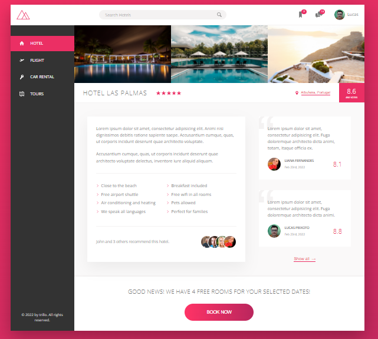

<h1 align="center">
   Treinamento CSS / Sass
</h1>

<br>

## 💻 Projeto Natours (https://natours-training.netlify.app/)


```bash
# Clone o repositório e entre na pasta do projeto
$ git clone https://github.com/lucasspeixoto/advanced-css-tips.git && cd advanced-css-tips && cd natours

# Instale as dependências
$ npm install

# Execute a aplicação
$ npm run start

# Abra http://127.0.0.1:5500/natours/index.html no seu navegador para ver a aplicação rodando!
```

## 💻 Projeto Trillo (https://trillo-training.netlify.app/)



```bash
# Clone o repositório e entre na pasta do projeto
$ git clone https://github.com/lucasspeixoto/advanced-css-tips.git && cd advanced-css-tips && cd trillo

# Instale as dependências
$ npm install

# Execute a aplicação
$ npm run start

# Abra http://127.0.0.1:5500/trillo/index.html no seu navegador para ver a aplicação rodando!
```

## 📝 Licença

Este projeto está licenciado sob a Licença MIT. Veja o arquivo [LICENSE](LICENSE) para obter mais detalhes.

---
